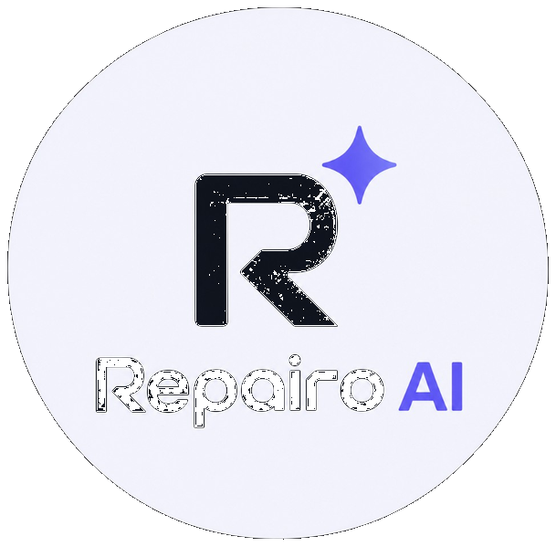
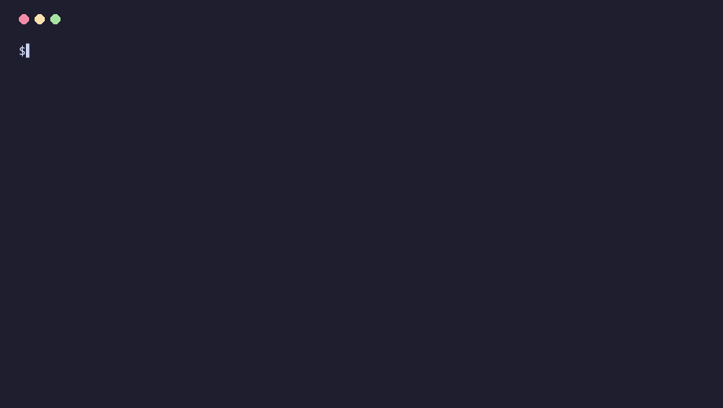
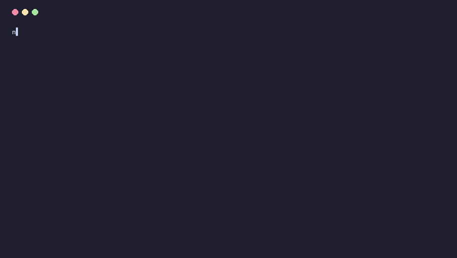

<p align="center">
  
</p>

<h1 align="center">Repairo</h1>

<p align="center">
  <strong>Dependabot bumps the package. Repairo fixes the call sites that break.</strong>
</p>

<p align="center">
  OpenAPI-grounded breaking-change detection · AST impact mapping · compile-checked repair PRs
</p>

<p align="center">
  <a href="https://www.heyrepairo.in">Website</a>
  ·
  <a href="https://www.heyrepairo.in/demo">Live demo</a>
  ·
  <a href="https://www.heyrepairo.in/docs">Docs</a>
  ·
  <a href="https://www.npmjs.com/package/repairo-cli">npm</a>
  ·
  <a href="https://github.com/adityacs50-lab/Repairo/issues">Issues</a>
</p>

<p align="center">
  <a href="https://www.npmjs.com/package/repairo-cli"></a>
  <a href="https://www.npmjs.com/package/repairo-cli"></a>
  <a href="./LICENSE"></a>
  <a href="https://github.com/adityacs50-lab/Repairo/stargazers"></a>
  <a href="https://github.com/adityacs50-lab/Repairo/actions/workflows/test.yml"></a>
  
  
</p>

---

## See it (30 seconds)

**CLI on this repo’s fixtures** (animated terminal capture — same commands you can run locally):

<p align="center">
  
</p>

```bash
npx repairo-cli scan ./fixtures/consumers --vendors stripe
```

<p align="center">
  
</p>

**Full pipeline in the browser** (no install): [heyrepairo.in/demo](https://www.heyrepairo.in/demo) — OpenAPI diff → impact → patch → validation on bundled scenarios.

---

## Quick start

No signup. No config file.

```bash
npx repairo-cli scan ./src --vendors stripe,openai,supabase
```

Global install + typical workflow:

```bash
npm install -g repairo-cli   # requires Node ≥ 22

repairo init --repo owner/your-app --vendors stripe,openai
repairo scan ./src
repairo check --vendors stripe,openai --target ./src
repairo repair --dry-run --target ./src
repairo repair --create-pr     # needs git + GitHub token for PR creation
```

Try the **in-repo fixture** without touching your app:

```bash
git clone https://github.com/adityacs50-lab/Repairo.git && cd Repairo
npm install
npx repairo-cli scan ./fixtures/consumers --vendors stripe
cp fixtures/breaking-api-demo/specs/old-openapi.json .repairo/snapshots/openapi.json
npx repairo-cli diff --spec ./fixtures/breaking-api-demo/specs/new-openapi.json --target ./fixtures/breaking-api-demo
```

---

## The problem

Version bumpers update `package.json`. They do **not** rewrite your call sites when a vendor removes a field, renames a parameter, or ships a new base path.

You end up grepping the repo, fixing files by hand, or handing broad context to an AI agent — hard to audit and easy to miss edge cases.

---

## What Repairo does

- **Watches vendor OpenAPI** (live fetch or pinned specs) and computes a structural diff
- **Maps impact** with compiler-grade parsing (TypeScript/JavaScript via `ts-morph`; Python/Go tokenizer paths in the engine)
- **Applies deterministic AST/token transforms** where the spec change is unambiguous
- **Validates before proposing** — TypeScript/JavaScript typecheck; Python/Go syntax checks (optional Pyright when your project already has config)
- **Opens a reviewable PR** with evidence — **never auto-merges**, especially when optional agent assist was used

Optional: `repairo repair --agent-resolve` proposes enum mappings only when the diff is ambiguous (off by default; needs your `ANTHROPIC_API_KEY`).

---

## Supported today (honest)

| Area | Status |
| --- | --- |
| **npm CLI** (`repairo-cli`) | Shipped — badges above reflect live npm/GitHub stats |
| **Languages** | **TypeScript/JavaScript** strongest; **Python** and **Go** repair paths exist with dedicated tests — expect rough edges on untyped or dynamic code |
| **Vendors (watch list)** | Stripe, OpenAI, Anthropic, Supabase, Gemini, GitHub REST — plus your own OpenAPI files via `diff` / snapshots |
| **Hosted app** | Beta at [heyrepairo.in](https://www.heyrepairo.in) — GitHub connect, watch list, repair PRs |
| **GitHub App** | In repo (`src/github-app/`) — self-host or use when app slug is configured on the site |
| **Distribution** | Early — treat stars/downloads as **signal**, not “customers” |

Proof you can run locally: `npm test` (engine + GitHub app + Python/Go repair + web app suites). CI runs the same workflow on every push to `main`.

---

## Example repair

From the `breaking-api-demo` fixture (`max_tokens` → `max_output_tokens` on chat completions):

```diff
- const response = await openai.chat.completions.create({
-   model: "gpt-4",
-   max_tokens: 500,
- });

+ const response = await openai.chat.completions.create({
+   model: "gpt-4",
+   max_output_tokens: 500,
+ });
```

Scoped to the real call site via AST — unrelated objects with the same property name are left alone.

---

## How it works

```
OpenAPI (before → after)
        │
        ▼
  Structural diff
        │
        ▼
  Impact map (AST / tokens)
        │
        ▼
  Deterministic patch (+ optional agent proposal for ambiguous enums)
        │
        ▼
  Compile / syntax validation
        │
        ▼
  GitHub PR (human review)
```

---

## Repairo vs…

| | Dependabot / Renovate | AI coding agents | **Repairo** |
|---|:---:|:---:|:---:|
| Bumps package version | ✅ | — | ✅ (via your workflow) |
| Fixes calling code | ❌ | ✅ (probabilistic) | ✅ (deterministic where spec is clear) |
| Checked before you see a PR | N/A | Often no | ✅ (typecheck / syntax gate) |
| Ambiguous mappings | N/A | Often silent guesses | Flagged or agent-**proposed**, review required |
| Customer source in the cloud | N/A | Often broad context | CLI is local; hosted beta uses OAuth scopes you approve |

---

## CI

```yaml
# .github/workflows/repairo.yml
name: API contract check
on:
  schedule:
    - cron: "0 6 * * *"
  workflow_dispatch:

jobs:
  check:
    runs-on: ubuntu-latest
    steps:
      - uses: actions/checkout@v4
      - uses: adityacs50-lab/Repairo@main
        with:
          vendors: stripe,openai
          target: ./src
```

First run writes baselines under `.repairo/snapshots/` (commit them). Later runs fail when a watched contract breaks.

---

## Privacy & security

- **CLI**: runs on your machine; repairs are computed in-process for local commands.
- **Hosted / GitHub App**: only the OAuth scopes and webhooks you configure — see [security](https://www.heyrepairo.in/security).
- **Agent resolve**: sends minimal structured context (field names + candidates), not whole files, when you opt in.
- Vulnerabilities: [info@heyrepairo.in](mailto:info@heyrepairo.in) (please don’t file public issues for security reports).

---

## Development

```bash
npm install
npm run dev          # Next.js app (heyrepairo.in UI)
npm test             # full test matrix
npm run repairo -- scan ./fixtures/consumers
```

Demo asset sources: [docs/assets/README.md](./docs/assets/README.md).

---

## Contributing

Issues and focused PRs welcome — especially repro fixtures and deterministic repair cases.

- [Open an issue](https://github.com/adityacs50-lab/Repairo/issues)
- Keep the deterministic repair path strict; don’t expand unsupervised AI write access

---

## License

[Apache-2.0](./LICENSE)
