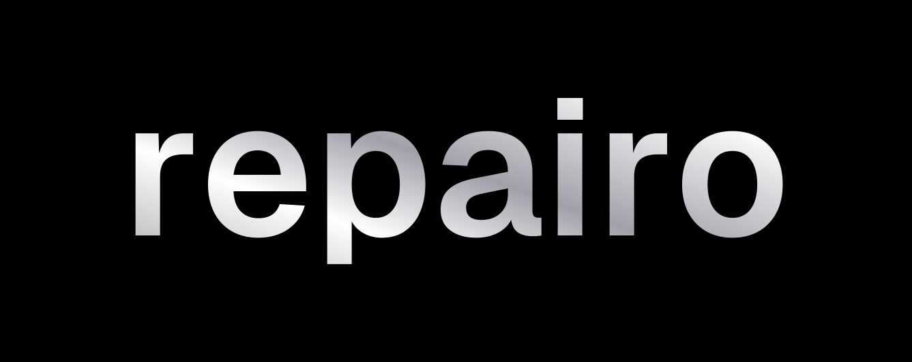

<p align="center">
  <picture>
    <source media="(prefers-color-scheme: dark)" srcset="brand/logo-horizontal-light.png">
    <source media="(prefers-color-scheme: light)" srcset="brand/logo-horizontal.png">
    
  </picture>
</p>

<p align="center">
  <b>Like Dependabot, built for API stability.</b>
</p>

<p align="center">
  <a href="#install">Install</a> · 
  <a href="#quickstart">Quickstart</a> · 
  <a href="DEPLOY.md">Documentation</a> · 
  <a href="src/lib/catalog/vendors.ts">API Catalog</a> · 
  <a href="https://github.com/adityacs50-lab/Repairo/issues">Issues</a>
</p>

<p align="center">
  
  
  
  
  
</p>

Repairo is an automated API maintenance toolchain with compiler-grade AST primitives — scan, map, refactor, verify — executed in volatile RAM. Your third-party API dependencies (Stripe, Clerk, OpenAI) become monitored contracts that Repairo auto-patches, generates Pull Requests for, and secures without saving a single line of proprietary code to disk.

→ Compare Repairo to [Dependabot](#how-it-works), [Speakeasy](#faq), and [Generalist AI Assistants](#zero-hallucination-reliability).

## Install

Run a quick local scan using `npx` (no installation required):

```bash
npx @repairo/cli scan ./src --vendors stripe,openai,supabase
```

Or install the CLI globally to automate your local development and CI/CD pipelines:

```bash
npm install -g @repairo/cli
```

## Quickstart

Initialize configuration and link your codebase:

```bash
# 1. Link your repository
repairo init --repo owner/your-app

# 2. View AST refactoring diff for breaking spec drifts
repairo diff --spec https://api.stripe.com/v1/openapi.json

# 3. Apply AST patches and open a reviewable Pull Request
repairo repair --create-pr
```

## How It Works

Traditional dependency updates only bump version numbers in `package.json`, leading to compilation errors and silent runtime outages when API interfaces break. Repairo monitors the entire provider-consumer lifecycle:

```
┌───────────────────────────┐      ┌───────────────────────────┐
│ 1. Vendor OpenAPI Poller  │ ───► │ 2. Repository Spec Scan   │
│ (Monitors 500+ endpoints) │      │ (Detects call-site deltas)│
└───────────────────────────┘      └─────────────┬─────────────┘
                                                 │
                                                 ▼
┌───────────────────────────┐      ┌───────────────────────────┐
│ 4. Automated PR Engine    │ ◄─── │ 3. Volatile RAM AST Engine│
│ (Opens verified GitHub PR)│      │ (~24ms purge cycle)       │
└───────────────────────────┘      └───────────────────────────┘
```

1. **OpenAPI Spec Polling:** Background worker services continuously monitor vendor specs (Stripe, Clerk, OpenAI) for parameter modifications and method deprecations.
2. **Blast Radius Scanning:** Repairo scans your local repository to map the exact locations where the updated API is called.
3. **Volatile AST Refactoring:** Repairo streams code into an isolated, volatile RAM buffer, parses it using Tree-sitter and the TypeScript Compiler API, and executes deterministic AST transformations to align your code with the new SDK signature.
4. **Verified PR Delivery:** Pushes a branch and opens a reviewable GitHub Pull Request containing clean, compile-verified patches and changelog details.

## Zero-Hallucination Reliability

Unlike general AI coding assistants (Cursor, Devin, Copilot) that rely on probabilistic LLM guessing, Repairo is built on a **deterministic compiler engine**:

* **0% Syntax Hallucinations:** Transformations are compiled as strict AST transformations. Code changes either compile perfectly or are blocked before push.
* **Preserves Custom Implementations:** The AST engine modifies only the specific API call-site parameters, leaving your surrounding business logic, formatting, and helper wrappers untouched.

## Security & Compliance: The 24ms Volatile RAM Vault

To meet the strict compliance requirements of enterprise security teams, Repairo isolates all code processing:

* **Zero Disk Persistence:** No codebase files, secrets, or temporary AST snippets are written to physical disk, databases, or log files.
* **Immediate Purge Cycle:** AST compilation and refactoring occur entirely in volatile RAM. The moment the git commit is generated and pushed, the RAM memory block is zero-filled in **~24ms**.
* **Zero Model Training:** Repairo never stores, processes, or trains any models on your proprietary intellectual property.

## Pricing

Repairo is built on an **APIs Protected** infrastructure pricing model. Decide which integrations are mission-critical and pay for operational stability:

* **Developer Tier (Free):** CLI local scanning, manual rule triggers, open-source presets, up to 3 automated repo runs/month.
* **Team Tier ($150/month):** Automated background spec monitoring, 24ms Volatile RAM Vault automation, 100% automated PR generation, unlimited repository runs.
* **Enterprise Tier (Custom):** Custom private API spec mapping, private VPC hybrid runner agent, dedicated SLA, and SSO/RBAC controls.

## FAQ

#### What does Repairo actually do?
Whenever external APIs or SDKs you rely on (like Stripe, OpenAI, Clerk, or Supabase) update their interfaces, your code breaks. Repairo automatically detects these spec drifts, scans your repository, and opens a clean, compile-ready Pull Request to update the syntax before production fails.

#### Do you store or train on our company's private code?
No. The core parser is fully open-source. For automated hosted runs, code processing occurs entirely in-memory using our Volatile RAM Vault, which completely purges all trace code in ~24ms.

#### How is this different from GitHub Copilot or Cursor?
Generalist AI assistants use probabilistic LLMs to write code. They are highly flexible but suffer from a ~20% compilation and logic error rate. Repairo is a deterministic compiler tool built specifically for API migrations; it either generates a 100% compile-guaranteed patch or alerts you immediately.

---

<p align="center">
  Made with ❤️ by the Repairo Team.
</p>
