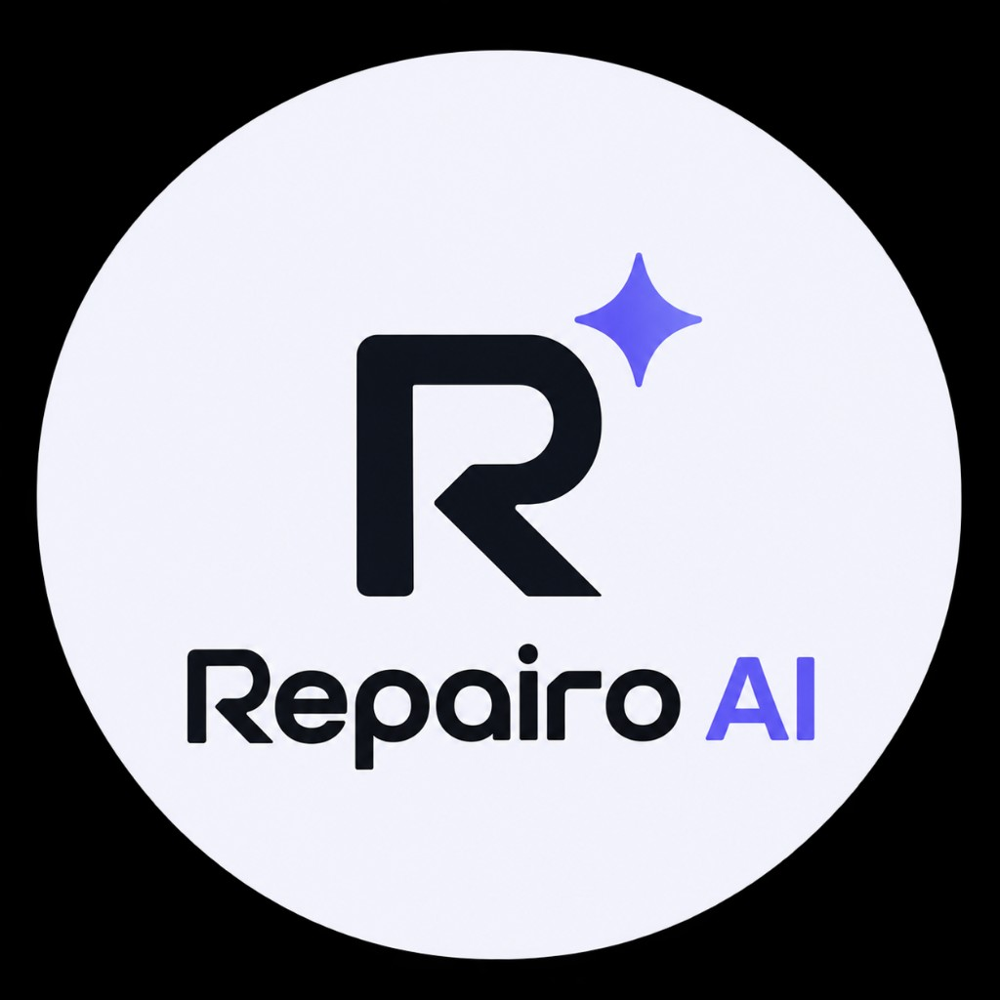

<h1 align="center">
  
</h1>

<p align="center">
  <strong>Dependabot updates your package.json. Repairo fixes the code that breaks when it does.</strong>
</p>

<p align="center">
  <a href="https://www.npmjs.com/package/repairo-cli"></a>
  <a href="./LICENSE"></a>
  <a href="https://github.com/adityacs50-lab/Repairo/issues"></a>
</p>

---

## Get started in 30 seconds

```bash
npx repairo-cli scan ./src --vendors stripe,openai,supabase
```

That's it — no signup, no config file. It scans your codebase for third-party API dependencies and tells you what it finds. Everything below is what happens once it finds something breaking.

---

## The problem

A vendor API you depend on ships a breaking change — a renamed field, a removed enum value, a parameter that's now required. Today you find out one of two ways:

1. **Dependabot/Renovate bump the package version**, your build still breaks, and you spend an afternoon grepping for every call site.
2. **An AI coding agent rewrites the code for you** — but it's probabilistic. It can hallucinate a fix that compiles clean and is still wrong, and it means sending your codebase to a third-party model with no deterministic check on what comes back.

Repairo is built for the gap between those two: **deterministic AST repair, with an LLM only ever proposing — never writing — for the one class of case a spec diff genuinely can't resolve on its own.**

---

## How it works

```
OpenAPI spec (before → after)
        │
        ▼
  diffOpenApi()            — structural diff: what actually changed, and how
        │
        ▼
  findImpactedCode()       — ts-morph AST scan of your repo: which call sites are affected
        │
        ▼
  applyAstTransforms()     — deterministic AST rename/insert on the real syntax tree
        │                    (an LLM proposal can enter here ONLY for a genuinely
        │                    ambiguous enum rename — see below)
        ▼
  validateInMemory()/tsc   — the patch must actually compile before it's ever proposed
        │
        ▼
  Pull Request              — labeled, scored, never auto-merged when AI-assisted
```

Every step through the compile check is deterministic — no model in the loop, no probability of a hallucinated rewrite. The one place an LLM can help at all is when the spec diff itself is ambiguous (see below), and even there it never touches your files directly.

---

## Example: a real rename, patched deterministically

```diff
// Before: vendor's old parameter name
- const response = await openai.chat.completions.create({
-   model: "gpt-4",
-   max_tokens: 500,
- });

// After: Repairo's AST patch — same call, updated parameter, nothing else touched
+ const response = await openai.chat.completions.create({
+   model: "gpt-4",
+   max_output_tokens: 500,
+ });
```

This isn't a regex find-and-replace — it's a real `ts-morph` AST mutation, scoped to the actual call site (an unrelated object literal with a field of the same name is left untouched), then compile-verified before it's ever shown to you.

---

## The one place we use an LLM — and exactly how it's constrained

Sometimes a spec removes several enum values while adding several new ones. The diff alone can't prove which maps to which — guessing here is exactly the kind of unverified rewrite this project exists to avoid, so the deterministic engine correctly refuses and flags it for manual review.

Optionally (`--agent-resolve`, requires your own `ANTHROPIC_API_KEY`), Repairo asks an LLM to propose a mapping for that one ambiguous case. **The AI never writes to your code — it proposes, Repairo verifies:**

- The proposed target is constrained by a strict JSON-schema `enum` to the actual candidate values from the diff — the model cannot propose anything outside what the spec itself added.
- An accepted proposal is fed into the *exact same* deterministic AST transform used for the unambiguous case — no agent-specific code-mutation path exists.
- The patch still has to compile before it's ever proposed.
- **A PR containing any AI-proposed fix is never auto-merge eligible, regardless of confidence.** Confidence is model-self-reported, not a calibrated probability — it's there for the human reviewer, not as a trust signal.
- Off by default. Requires two independent opt-ins (`--agent-resolve` and your own API key) — neither alone does anything.

---

## Installation

```bash
npm install -g repairo-cli
```

```bash
repairo init --repo owner/your-app            # link your repository
repairo scan ./src                            # find API dependencies
repairo check --vendors stripe,openai         # diff live vendor specs vs. your snapshot, exit non-zero on breakage
repairo repair --create-pr                    # generate the AST patch, compile-verify it, open a PR
```

### Run it in CI

```yaml
# .github/workflows/repairo.yml
name: API contract check
on:
  schedule:
    - cron: "0 6 * * *"
  workflow_dispatch:

jobs:
  check:
    runs-on: ubuntu-latest
    steps:
      - uses: actions/checkout@v4
      - uses: adityacs50-lab/Repairo@main
        with:
          vendors: stripe,openai
          target: ./src
```

The first run saves a baseline snapshot (commit it); every run after that fails the job the moment a watched vendor's contract changes underneath you.

---

## Comparison

| | Dependabot / Renovate | General AI coding agents | Repairo |
|---|:---:|:---:|:---:|
| Fixes the version number | ✅ | — | ✅ |
| Fixes the code that calls it | ❌ | ✅ (probabilistic) | ✅ (deterministic) |
| Guaranteed to compile before you see it | N/A | ❌ | ✅ |
| Ambiguous cases | N/A | Guessed silently | Flagged, or LLM-proposed with mandatory review — never auto-merged |
| What leaves your machine for an ambiguous case | Nothing | Full file context | Field names, path, candidate values only — never source code |

---

## Pricing

- **Free** — $0. 1 watched integration, 15 repair runs/month, real GitHub PRs, the fixture playground.
- **Pro** — $29/mo. 50 watched integrations, 500 runs/month, 15 team seats, priority webhook processing, billing portal.

---

## Security

Please report vulnerabilities to [info@heyrepairo.in](mailto:info@heyrepairo.in) rather than filing a public issue.

---

## Contributing

Issues and PRs welcome: [github.com/adityacs50-lab/Repairo](https://github.com/adityacs50-lab/Repairo/issues).

---

## License

Apache-2.0. See [LICENSE](./LICENSE).
